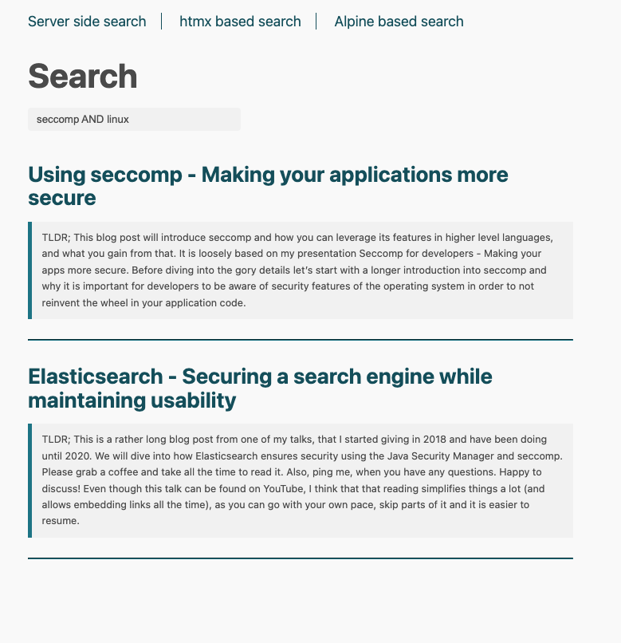
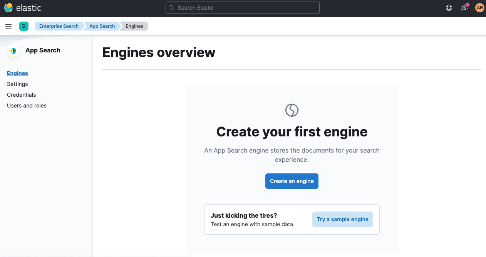
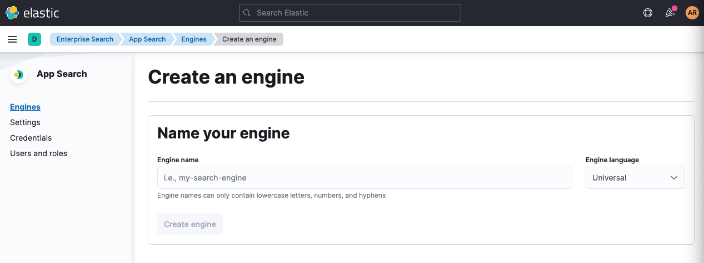
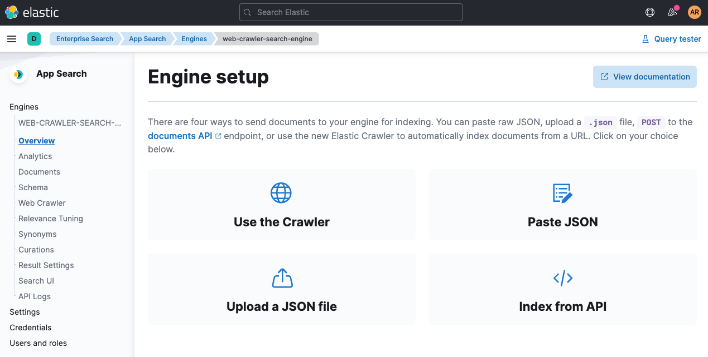
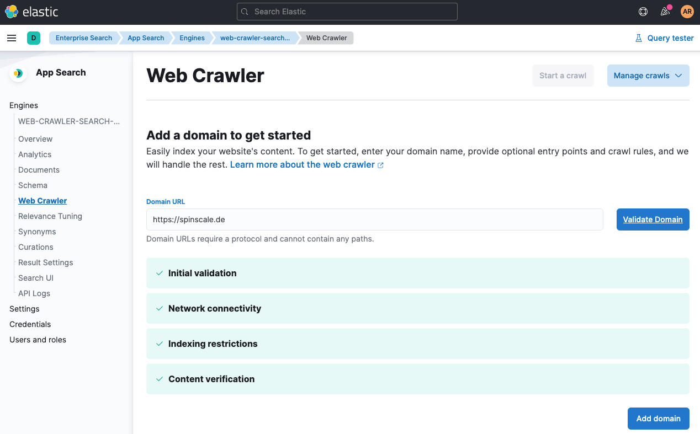
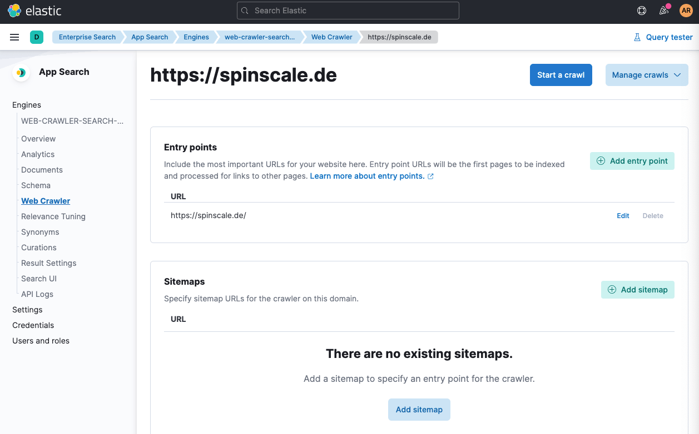
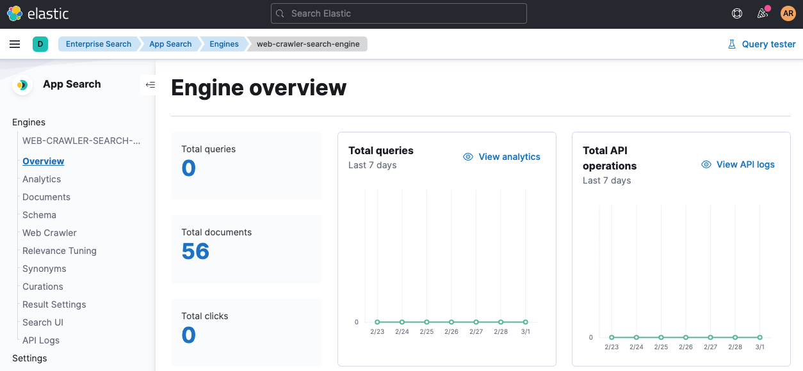
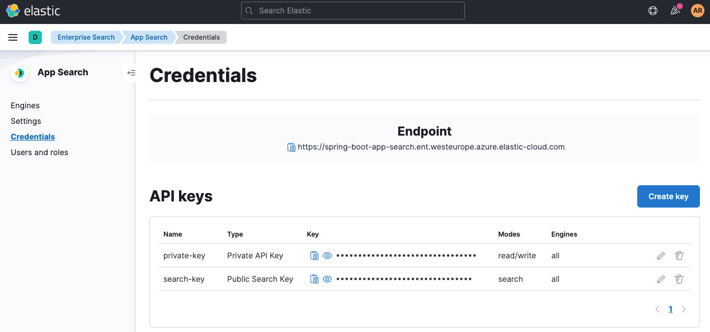

# Spring Boot App Search Demo

This is a demo of Spring Boot in combination with Elastic App Search.



## Using Terraform to start Elastic App Search

Using the [Terraform Elastic Cloud
Provider](https://registry.terraform.io/providers/elastic/ec/latest/docs)
you can spin up a full environment by running:

```bash
terraform validate
terraform init
terraform apply
```

The above link to the cloud provider also shows the steps required to
generate an API key in Elastic Cloud.

The environment should be spun up within a few minutes.

## Crawling data from a website

After spinning up the environment, you can log into Kibana, click on
`Enterprise Search` (or in the navbar) and select `Elastic App Search`.



Now on to `Create an engine`



Name the engine `web-crawler-search-engine`

Then select `Use a crawler` and add a domain. 



I went with `spinscale.de` in  this example. Click `Add Domain`.



Now start a crawl (the buttom at the top) to make sure data is indexed



After a few moments of waiting, you should see something like this in the
`Overview` of your crawler search engine, indicating that documents have
been indexed



Once documents are indexed, we can configure the Spring Boot Application:

## Configuring `application.conf` file

The only file that needs adaption is the `application.conf` file. There are
two parameters, that require adaption (or three, depending on how you named
your app search engine).

```
appsearch.url=https://dc3ff02216a54511ae43293497c31b20.ent-search.westeurope.azure.elastic-cloud.com
appsearch.engine=web-crawler-search-engine
appsearch.key=search-untdq4d62zdka9zq4mkre4vv
```

Let's start with the `key`. That one can be extracted from the `Credentials`
page.



Copy the value of the `search-key` into the `application.conf` file. You can
also copy the `url` from this page, as it is shown as the endpoint right at
the top. Ready to start the application via

```bash
./gradlew clean bootRun
```

You can now open the browser at [http://localhost:8080](http://localhost:8080)

## Searching Data via Spring Boot Application

### Feign Client

For server side queries, this example uses
[Feign](https://github.com/OpenFeign/feign) to dynamically create a HTTP
request from a Java interface. The interface looks like this

```java
@FeignClient(name = "appsearch", url="${appsearch.url}")
public interface AppSearchClient {

    @GetMapping("/api/as/v1/engines/${appsearch.engine}/search")
    QueryResponse search(@RequestBody Query query);
}
```

### Searching - Server Side

The server side implementation is the old school way of doing things: A
request parameter gets used as a query for the App Search and the full HTML
page gets rendered in the response. This is done using thymeleaf, the
default rendering engine of spring boot.

### Searching - htmx

[htmx](https://htmx.org/) makes it incredibly easy to only render a part of a page by
annotating HTML elements like this:

```html
<input type="search" autocomplete="off"
       name="q" placeholder="Begin Typing To Search Articles..."
       hx-post="/htmx-search"
       hx-trigger="keyup changed delay:500ms, search"
       hx-target="#search-results"
       hx-indicator=".htmx-indicator"
       >
```

You can see the attributes starting with `hx-`, that trigger an AJAX request
via `hx-post`, half a second after the last key was pressed and puts the
result into the ID of the `hx-target`, while displaying elements having
`htmx-indicator` class.

I can't tell you how much JS I usually would need for that...

The response does not need to contain full HTML, but just the snippet that
should be displayed in the `search-results` div.

While this approach looks alien at first after being used to so many JS
frameworks I enjoy the clean and fresh approach to server side rendering,
having dynamic pages without javascript.

### Searching - client side via Alpine.js

The last search example is a little different, because it does everything in
the browser, including sending the queries to the app search instance. This
is ok, because we are using a search key, that can only use the search
endpoint.

This works by utilizing the app search client directly in the browser and
using [AlpineJS](https://alpinejs.dev/) for dynamically updating the DOM.

The `alpine-js.html` initializes the client like this (using the properties
from the `application.conf`):

```html
<script th:inline="javascript">
var client = window.ElasticAppSearch.createClient({
  searchKey: [[${@environment.getProperty('appsearch.key')}]],
  endpointBase: [[${@environment.getProperty('appsearch.url')}]],
  engineName: [[${@environment.getProperty('appsearch.engine')}]]
});
</script>
```

The logic to send a request to app search is done on every `keyup` event
like this:

```html
<div>
  <form @submit.prevent="">
    <input type="search" autocomplete="off" placeholder="..." style="width:20em"
           x-model="q"
           @keyup="client.search(q).then(resultList => results = resultList.results)">
  </form>
</div>
```

The rendering of the results is done using the `template` HTML tag

```html
<template x-for="result in results">
  <template x-if="result.data != null && result.data.title != null && result.data.url != null && result.data.meta_description != null ">
    <div>
      <h4><a :href="result.data.url.raw" x-text="result.data.title.raw"></a></h4>
      <blockquote style="font-size: 0.7em" x-text="result.data.meta_description.raw"></blockquote>
      <hr>
    </div>
  </template>
</template>
```

## Running tests

I have added a single test, that assumes that the crawling has taken place
with the `spinscale.de` domain. The test is `AppSearchClientTests` and is
not mocked or anything, but runs a single search against the app search
instance. You can tune this as you like for your concrete use-case, but
should give a feel, how the response data structure looks like.

```java
@SpringBootTest(classes = SpringBootAppSearchApplication.class, webEnvironment = SpringBootTest.WebEnvironment.NONE)
class AppSearchClientTests {

	@Autowired
	private AppSearchClient appSearchClient;

	@Test
	void testFeignAppSearchClient() {
		final QueryResponse queryResponse = appSearchClient.search(Query.of("seccomp"));
		assertThat(queryResponse.getResults()).hasSize(4);
		assertThat(queryResponse.getResults().stream().map(QueryResponse.Result::getTitle))
				.contains("Using seccomp - Making your applications more secure",
						  "Presentations",
						  "Elasticsearch - Securing a search engine while maintaining usability",
						  "Posts"
				);
	}
}

```

## TODO/Missing

* Pagination support is something that could be added easily, but I did not
  have any time for that so far.
